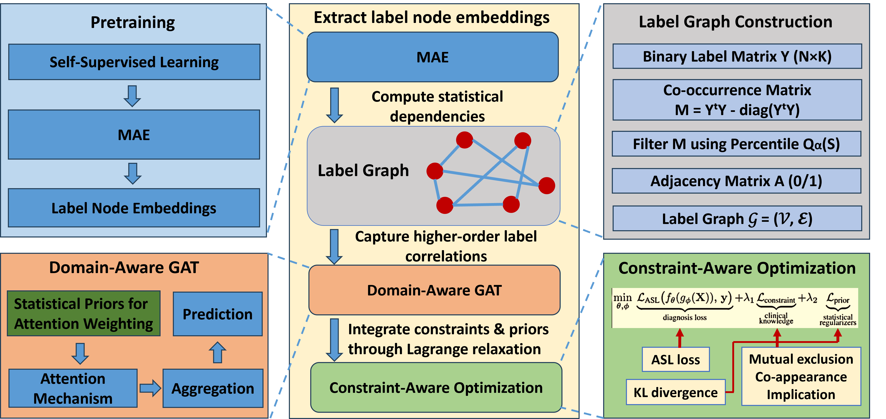

# MIRNet: Integrating Constrained Graph-Based Reasoning with Pre-training for Diagnostic Medical Imaging

The overall architecture of MIRNet. The central diagram shows the main workflow: a pretrained MAE extracts image embeddings, a label graph is built from statistical dependencies, and a domain-aware GAT captures higher-order label correlations. The model is then trained via a constraint-aware optimization mechanism. The left panel details domain-aware pretraining and the GAT, while the right panel illustrates label graph construction and constraint-aware optimization.
# Dataset: TongueAtlas-4K
TongueAtlas-4K is a high-resolution dataset consisting of 4,000 tongue images collected from clinical patients, annotated by certified Traditional Chinese Medicine (TCM) experts.
The dataset is available [here](https://doi.org/10.5281/zenodo.17557646).
# Installation
Before running the project, make sure to install all required dependencies:
```
pip install -r requirements.txt
```
# Run
To train the model: 

To test the model:
# Paper
Our paper has been accepted by AAAI 2026 (to appear).
